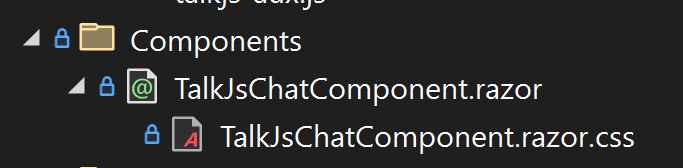
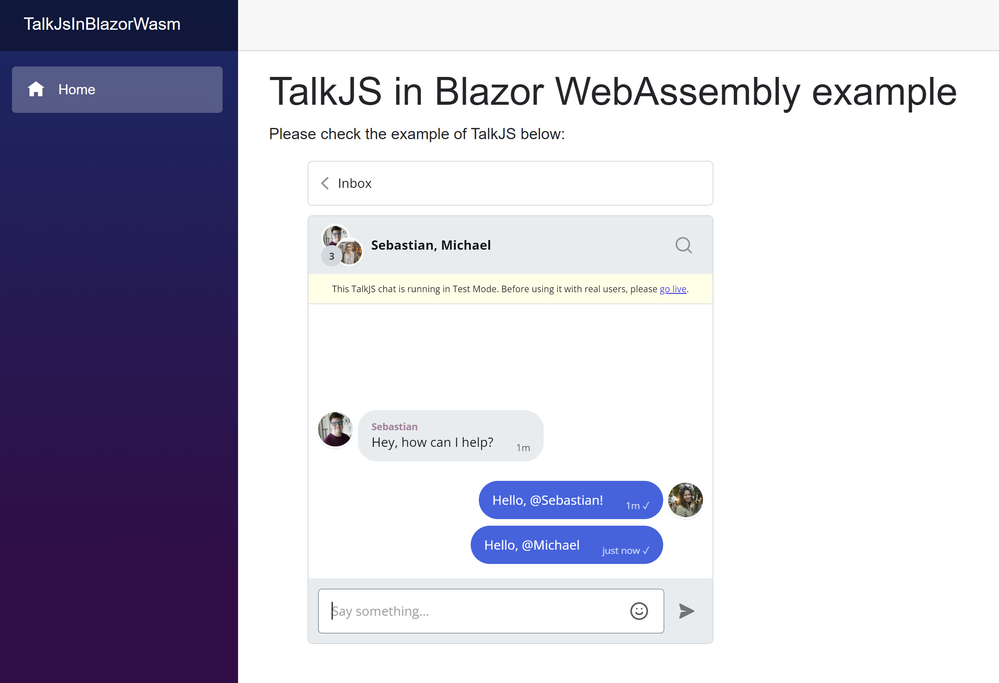

# Add TalkJS chat to your existing Blazor Wasm app

Adding a live chat to your app is a common thing you want to do, but very often it turns out to be more challenging than it should.

In this article I'll discuss how you can quickly and easily make a chat component for your Blazor WebAssembly (WASM) app which uses all the power of TalkJS.

The tutorial presumes you have a working knowledge of Blazor WASM and Javascript. The tutorial also presumes you'll be handling user management, authentication and configuration on your own. The tutorial is using Blazor WebAssembly in C# on .NET 7 and is relying on JSInterop functionality of .NET which allows Blazor apps to run Javascript code.

## Initialize Talk in Javascript

In your `index.html` file we need to add the following script to initialize Talk:

```javascript
<script>
    (function (t, a, l, k, j, s) {
        s = a.createElement('script'); s.async = 1; s.src = "https://cdn.talkjs.com/talk.js"; a.head.appendChild(s)
            ; k = t.Promise; t.Talk = {
                v: 3, ready: {
                    then: function (f) {
                        if (k) return new k(function (r, e) { l.push([f, r, e]) }); l
                            .push([f])
                    }, catch: function () { return k && new k() }, c: l
                }
            };
    })(window, document, []);
</script>
```

Now we'll have the `Talk` object available in our Javascript code.

Just after that create and add an inclusion of another Javascript file:

`<script src="talk-aux.js"></script>`

We will use this file to make a Javascript wrapper around the needed Talk functions so they can be easily called from Blazor.

## Javascript wrapper around Talk object for easier Blazor access

For the purpose of this article we are following the official Getting started documentation for Vanilla Javascript: https://talkjs.com/docs/Getting_Started/

Based on this initial example, we will create a `TalkAux` object which will function as a wrapper around the `Talk` object provided by TalkJS, but adapted to work better with Blazor.

In this object we will define a function `createOneOnOneConversation` which is used to creat a conversation between two user accounts. The function's input parameters are:

- appId - your unique App Id taken from the Dashboard
- myUser - user representing "me"
- otherUser - user representing the user I would like to chat to
- outputElementId - TalkJS comes with an automatically generated UI. This is the ID of the DOM element in which this UI will be rendered.

The `TalkAux` object would look like this:

```javascript
window.TalkAux = {
    /** Session for the talk that will be used */
    talkSession: undefined,

    /**
     * Function that creates a conversation between 2 users
     * @param {string} appId - appId from your Talk account
     * @param {object} myUser - object with parameters needed to create a Talk.User object
     * @param {object} otherUser - object with parameters needed to create a Talk.User object
     * @param {string} outputElementId - Id of the element where we want the window to be output to
     */
    createOneOnOneConversation: function (appId, myUser, otherUser, outputElementId) {

        // Create Talk.User objects
        var me = new Talk.User(myUser);
        var other = new Talk.User(otherUser);

        // Create a Talk.Session object
        this.talkSession = new Talk.Session({
            appId: appId,
            me: me,
        });

        // Create a conversation
        var conversation = this.talkSession.getOrCreateConversation(
            Talk.oneOnOneId(me, other)
        );
        conversation.setParticipant(me);
        conversation.setParticipant(other);

        // Mount a conversation into a given div
        var inbox = this.talkSession.createInbox({ selected: conversation });
        inbox.mount(document.getElementById(outputElementId));
    }
}
```

To break the `createOneOnOneConversation` function down a bit, we first create `Talk.User` objects with the information provided from input parameters. Then we create a `Talk.Session` object. We create a new conversation and add the created users as participants. In the end we create an inbox and mount it to the given DOM element.

## Data models in Blazor

In order to make our lives easier, we will create a data model for a `User` in Blazor which will contain all properties that a `Talk.User` has:

```csharp
public class User
{
    public long Id { get; set; }
    public string Name { get; set; }
    public string Email { get; set; }
    public string PhotoUrl { get; set; }
    public string WelcomeMessage { get; set; }
}
```

The properties are pretty self-explanatory. If you are interested in deeper explanations feel free to visit the official docs: https://talkjs.com/docs/Concepts/Users/

Due to the way we developed our functions in the `TalkAux` object, we do not need any additional models.

## TalkJS Chat Component in Blazor

In Blazor we create a new component - let's call it `TalkJsChatComponent.razor`.

This component will take in three parameters and just output the TalkJS Chat UI with the two users connected into a conversation (using the functions above).

We need to define the input parameters:

```csharp
/// <summary>
/// The user representing the user of the app.
/// </summary>
[Parameter]
public User MyUser { get; set; }
/// <summary>
/// The user representing the other person the user of the app wants to talk to.
/// </summary>
[Parameter]
public User OtherUser { get; set; }
/// <summary>
/// AppId from the TalkJS Dashboard
/// </summary>
[Parameter]
public string AppId { get; set; }
/// <summary>
/// Id of the DOM element where TalkJS UI will be placed in.
/// </summary>
protected const string OUTPUT_DIV_ID = "talk-js-chat-div";
```

The component needs to have the `JSRuntime` injected. `JSRuntime` allows the use of Javascript Interop functionality (https://learn.microsoft.com/en-us/aspnet/core/blazor/javascript-interoperability/?view=aspnetcore-7.0). This will be used so our Blazor code can call the functions in the `TalkAux` Javascript object.

`JSRuntime` is injected using .NET's dependency injection by adding a directive:

`@inject IJSRuntime jsRuntime;`

The view of the component can be as simple / complex as you would like it to be. For the purpose of this article it will be just:

`<div id="@OUTPUT_DIV_ID" class="talk-js-main-chat-div"></div>`

_Do note that the ID of the `div` is using the `OUTPUT_DIV_ID` constant - just so we don't make a mistake in naming and passing the ID as a parameter._

The last thing left to do is to actually call the `createOneOnOneConversation` using JSInterop. We will do this in the `OnAfterRenderAsync` method of the component's lifecycle. The reason for this is that only in that moment is the whole DOM generated and Javascript properly loaded.

So, the code for that looks like this:

```csharp
protected override async Task OnAfterRenderAsync(bool firstRender)
{
    await base.OnAfterRenderAsync(firstRender);

    if (MyUser != null && OtherUser != null && !string.IsNullOrEmpty(AppId))
    {
        await jsRuntime.InvokeVoidAsync("TalkAux.createOneOnOneConversation", AppId, MyUser, OtherUser, OUTPUT_DIV_ID);
    }
}
```

## Potential styling of the TalkJS Chat Component

The TalkJS UI is already styled, and you can style it further through the config. So, if we keep the `TalkJsChatComponent.razor` as simple as in this example, it technically does not need any styling.

However, as we don't know where in the code we are going to be placing it, my preferred choice is to make the div with the TalkJS UI be with 100% width and height, and then have the container from the parent component... well... contain it! (And limit its width and height).

So, I'd prefer to add a `TalkJsChatComponent.razor.css` file in the same folder (which allows neat nesting of files in the Visual Studio IDE):



In the CSS file I literally add width and height to be 100%:

```css
.talk-js-main-chat-div {
    width: 100%;
    height: 100%;
}
```

## Adding the TalkJS Chat Component to an existing page or component

Now we're done and we have a reusable component that we can use anywhere in our Blazor WASM app. The only thing left is to show how it is used.

In a page (e.g. `Index.razor`) you want to add the `TalkJsChatComponent`. If you've done the styling in the way suggested in this document, you should be able to do something as simple as this:

```html
<div style="width: 500px; height: 500px;">
    <TalkJsChatComponent MyUser="Me" OtherUser="OtherUser" AppId="@APP_ID" />
</div>
```

Note that this code is passing the `Me` and `OtherUser` objects as parameters to the component, as well as the `APP_ID` string. We need to define these somewhere. So we can add some example code in the `@code` block of the page:

```csharp
@code {
    private const string APP_ID = "YOUR_APP_ID";
    protected User Me { get; set; }
    protected User OtherUser { get; set; }

    protected override async Task OnInitializedAsync()
    {
        await base.OnInitializedAsync();

        // Populate users any way you want
        // Most often from a database or something
        Me = new User()
            {
                Id = 123456,
                Name = "Alice",
                Email = "alice@example.com",
                PhotoUrl = "https://talkjs.com/images/avatar-1.jpg",
                WelcomeMessage = "Hey there! How are you? :-)",
            };

        OtherUser = new User()
            {

                Id = 654321,
                Name = "Sebastian",
                Email = "Sebastian@example.com",
                PhotoUrl = "+https://talkjs.com/images/avatar-5.jpg",
                WelcomeMessage = "Hey, how can I help?",
            };

        StateHasChanged();
    }
}
```

The code is pretty self-explanatory: in the `OnInitializedAsync` method we create two users and notify Blazor that the State has changed, so it rerenders necessary components.

## Conclusion

And that's it. If you've followed the steps above, you should end up with something nice and simple like this:



Also, the component we've just built is completely reusable from anywhere in our codebase.