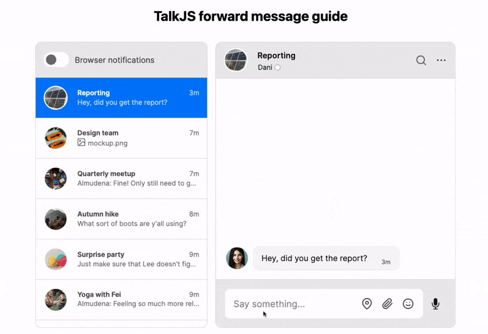

# How to add message forwarding to your chat

This is an example project for TalkJS's tutorial on [How to add a forward message feature to your chat](https://talkjs.com/resources/how-to-add-a-forward-message-feature/). 

<figure class="kg-image-card">
  
  <figcaption>A conversation with a forwarded message</figcaption>
</figure>

This project uses custom [message actions](https://talkjs.com/docs/Features/Messages/Message_Actions/) and the [TalkJS REST API](https://talkjs.com/docs/REST_API/) to allow users to forward text-based messages to conversations that they're part of.

> [!NOTE]
> This example implementation of message forwarding only supports forwarding text-based messages, not messages that are location shares, [voice messages](https://talkjs.com/docs/Features/Messages/Voice_Messages/), or [file attachments](https://talkjs.com/docs/Features/Message_Features/File_Sharing/). To extend the current functionality to also include forwarding files, see the information on [sending files with the REST API](https://talkjs.com/docs/REST_API/Messages/#send-a-file). 

> [!TIP]
> [Download this example project as a zip file](https://github.com/talkjs/talkjs-examples/releases/latest/download/howtos.how-to-add-forwarding.zip)

## Prerequisites

To run this example project, you need:

- A [TalkJS account](https://talkjs.com/dashboard/login)
- [Node.js](https://nodejs.org/en)
- [npm](https://www.npmjs.com/)

> [!NOTE]
> This guide uses `fetch` to be able to use the [Fetch API](https://developer.mozilla.org/en-US/docs/Web/API/Fetch_API) to get resources. `fetch` is available natively from Node.js 18 onward. If you use an older version of Node.js, you can use the [Node Fetch](https://www.npmjs.com/package/node-fetch) package. 

## How to run the example

1. Clone or [download this project](https://github.com/talkjs/talkjs-examples/releases/latest/download/howtos.how-to-add-forwarding.zip).
2. Add a custom message action to allow message forwarding.
    1. On the **Chat UI** page of your [TalkJS dashboard](https://talkjs.com/dashboard/), select the role for which you'd like to edit the settings. This guide uses the `default` role.
    2. Still on the **Chat UI** page, in the section 'Custom message actions', select **Add action** to add a message action.
    3. Give your action the name `forward` and the label `Forward`.
    4. Select which messages can be forwarded, and who can do the forwarding. For the purposes of this guide, for **Which messages** select that the action should be available for `All messages`, and for **Action available to**, select `Everyone`.
3. Add styling to distinguish forwarded messages in your theme. The following steps add a subtle but noticeable right-pointed arrow and the label *Forwarded* at the top of the message body of messages that have been forwarded.
    1. On the **Themes** page of your dashboard, select **Edit** for the theme that you’d like to use.
    2. To identify user messages that have been forwarded, go to the `UserMessage` component. Inside the `<template>` part of the code, find the section where it adds the `MessageBody`, and replace it with the following, which adds `forwardedFrom="{{custom.forwardedFrom}}"` to the message body props if the message has the `forwardedFrom` custom property:
        ```html
            <MessageBody t:if="{{ custom and custom.forwardedFrom }}"
                body="{{ body }}"
                timestamp="{{ timestamp }}"
                floatTimestamp="auto"
                showStatus="{{ sender.isMe }}"
                isLongEmailMessage="{{isLongEmailMessage}}"
                darkenMenuArea="{{ darkenMenuArea }}"
                referencedMessage="{{ referencedMessage }}"
                forwardedFrom="{{ custom.forwardedFrom }}"
            />
            <MessageBody t:else
                body="{{ body }}"
                timestamp="{{ timestamp }}"
                floatTimestamp="auto"
                showStatus="{{ sender.isMe }}"
                isLongEmailMessage="{{isLongEmailMessage}}"
                darkenMenuArea="{{ darkenMenuArea }}"
                referencedMessage="{{ referencedMessage }}"
            />
        ```
    3. Then, to style the message body of a forwarded message, go to `MessageBody` and add the following at the top inside the `<template>` section:
        ```html
        <div t:if="{{ forwardedFrom }}">
            <div class="forwarded-header">
                <svg xmlns="http://www.w3.org/2000/svg" xmlns:xlink="http://www.w3.org/1999/xlink" version="1.1" x="0px" y="0px" viewBox="0 0 100 125" style="enable-background:new 0 0 100 100;" xml:space="preserve">
                    <path d="M56.8,31.5V16c-0.1-0.8,0.1-1.6,0.7-2.2c1-1,2.7-1,3.8,0l32.4,28.9c0.6,0.6,0.8,1.3,0.8,2c0,0.7-0.2,1.5-0.8,2L61.4,75.5 c-0.5,0.6-1.2,1-2,1c-0.7,0-1.4-0.3-1.9-0.8c0,0,0,0,0,0c-0.6-0.6-0.8-1.4-0.7-2.2c0,0,0-14.6,0-15.5c-17.4,0-33.6-1.1-50.3,22.1 C3.3,84.3,5.8,31.3,56.8,31.5z" fill="#FFFFFF" opacity="0.8"/>
                </svg>
                <span class="forwarded-indicator">Forwarded</span>
            </div>
        </div>
        ```
    5. Still in `MessageBody`, add the following styles anywhere in the `<styles>` section:
        ```css
        /* Styles for forwarded messages */
        .forwarded-header {
            display: flex;
            align-items: center;
            margin-top: 0.5rem;
            margin-left: 0.5rem;
            margin-right: 0.8rem;
        }

        .forwarded-header svg {
            width: 1.5rem;
            height: 1.5rem;
            margin-right: 0.3rem;
        }

        .forwarded-indicator {
            color: #ffffff;
            font-style: italic;
            opacity: 0.8;
        }
        ```
4. Back in your project, add your own credentials. In `script.js` and `server.js`, replace `<APP_ID>` with your own app ID, and replace `<SECRET_KEY>` with your secret key for the TalkJS REST API. You can find both on the **Settings** page of your [TalkJS dashboard](https://talkjs.com/dashboard/).
5. Run `npm install` to install the dependencies.
6. Run `npm start` to start the server.

You now have a working example project in which users can forward messages. 

<figure class="kg-image-card">
  
  <figcaption>A menu with the option to forward a message, and an example of a forwarded message</figcaption>
</figure>

> [!NOTE]
> This example uses [Tailwind CSS](https://tailwindcss.com/) for styling. For ease of getting started, it adds Tailwind with the Play CDN, which is for development purposes only and should not be used in production. If you're planning to use Tailwind in production, follow the [installation instructions](https://tailwindcss.com/docs/installation).
