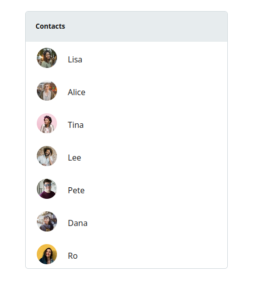
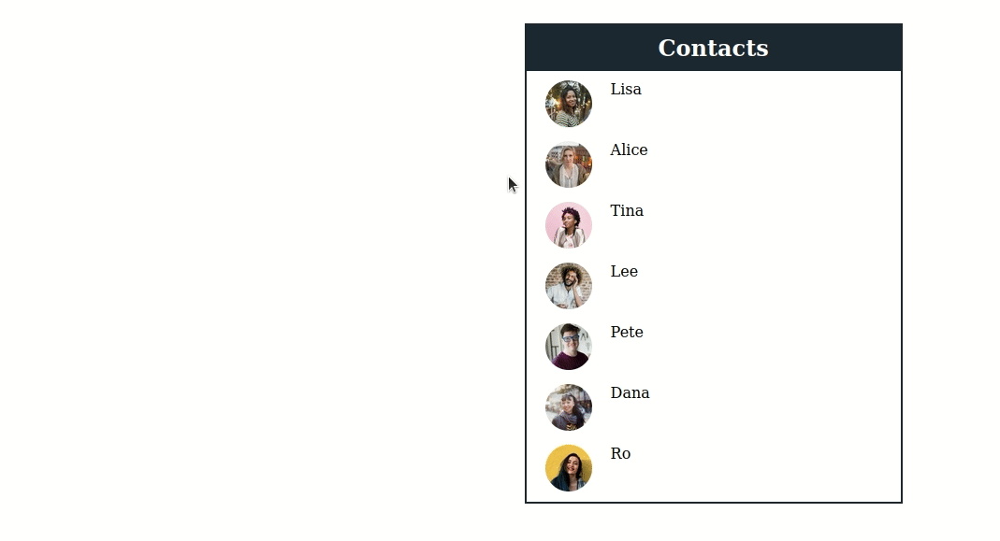

# Create a direct message chat with a contact list using TalkJS

In this tutorial we will create a direct message chat with a contact list using the [TalkJS chat API](https://talkjs.com). The chat will display a list of contacts from which a user can select a contact and open a `chatbox` with a conversation (and a history of that conversation if it exists).

This is similar to the functionality you see on platforms like Linkedin, WhatsApp and Telegram.

## Setting up our chat

The first thing we will do is set up a basic HTML page on which we will display our chat. On this page we will embed the TalkJS API in a script as specified in the [Getting Started Guide](https://talkjs.com/docs/Getting_Started/).

We start by creating a `div` to hold our chatbox and the contact list, using the code below:

```html
<div style="display: flex; justify-content: center">
    <!-- container element in which TalkJS will display a chat UI -->
    <div id="talkjs-container" style="width: 30%;>
        <i>Loading chat...</i>
    </div>

    <div id="contacts-list">
        <h2>Contacts</h2>
    </div>
</div>
```

Our `div` will have two `div`s within it with `id`s of `talkjs-container` and `contact-list` respectively. We also apply some basic styling so that the `contacts-list` div floats to the right side of the `talkjs-container` div.

### The contact list

The `contact-list` div will be populated by the list of contacts we can chat with. In production it is likely that these users will be retrieved from a database or another location. In our case we will create an array of hardcoded users. The array will contain objects of the users, each with an `id`, `name` and `photoUrl` property.

So we add the following code to our script:

```javascript
const contactsList = [
    {
        id: 1,
        name: 'Lisa',
        photoUrl: 'https://talkjs.com/images/avatar-1.jpg'
    },
    {
        id: 2,
        name: 'Alice',
        photoUrl: 'https://talkjs.com/images/avatar-2.jpg'
    },
    {
        id: 3,
        name: 'Tina',
        photoUrl: 'https://talkjs.com/images/avatar-3.jpg'
    },
    {
        id: 4,
        name: 'Lee',
        photoUrl: 'https://talkjs.com/images/avatar-4.jpg'
    },
    {
        id: 5,
        name: 'Pete',
        photoUrl: 'https://talkjs.com/images/avatar-5.jpg'
    },
    {
        id: 6,
        name: 'Dana',
        photoUrl: 'https://talkjs.com/images/avatar-6.jpg'
    },
    {
        id: 7,
        name: 'Ro',
        photoUrl: 'https://talkjs.com/images/avatar-7.jpg'
    },
];

```

After setting up up our array of users, the next step is to display them in the `contacts-list` div.

To display the contacts list we will loop through the `contactsList` array and use the contact objects inside that array to create a contacts list with usernames and profile pictures. We will also make the contacts clickable. Finally the list is rendered in the `contacts-list` div.

```javascript
// Display contacts list on page
// Get contacts list container from the DOM
const contactsWrapper = document.getElementById('contacts-list');
// Loop through array and display each contact in contact-list div
for (let contact of contactsList) {
    // Extract contact details
    const id = contact.id;
    const username = contact.name;
    const photoUrl = contact.photoUrl;

    //create img tag to hold contact pic, give it a class name (for styling purposes) and add photo to it
    const contactPhoto = document.createElement('img');
    contactPhoto.classList.add('contact-photo');
    contactPhoto.src = photoUrl;

    // Create div to hold contact Name and add name
    const usernameDiv = document.createElement('div');
    usernameDiv.classList.add('contact-name');
    usernameDiv.innerText = username;

    // Create contact parent div and add to it contactPhotoDiv and usernameDiv
    const contactContainerDiv = document.createElement('div');
    contactContainerDiv.classList.add('contact-container');

    contactContainerDiv.appendChild(contactPhoto);
    contactContainerDiv.appendChild(usernameDiv);

    contactsWrapper.appendChild(contactContainerDiv);
};
```

Now that we have loaded our contact list, let us add some styling to make it look nicer.

#### Styling the contact list

Since we are going to be doing a bit of styling, we will open a `style` tag at the top of our page and put all our CSS code there.

We want to reduce the size of the profile pictures, make them rounded and also float the names to the right of the profile pictures. We will also add a `hover` pseudo-class so that the user can easily see which contact they can select, and change the cursor to a pointer when it hovers over a contact.

Let us add the following code to our page:

```css
<style>

    #contacts-list {
        margin-top: auto;
        width: 700px;
        border: #d0d8dc solid 1px;
        border-radius: 6px;
        height: 510px;
        color: #111;
        font-family: 'Open Sans', sans-serif;
    }

    #contacts-list h2 {
        color: #fff;
        background: #e7ecee;
        border-top-left-radius: 5px;
        border-top-right-radius: 5px;
        font-size: 13.3px;
        font-weight: 700;
        margin: 0;
        padding-top: 20px;
        padding-left: 20px;
        text-align: left;
        height: 40px;
    }
    
    .contact-container {
        height: 50px;
        display: flex;
        margin: 5px 0;
        cursor: pointer; 
    }

    .contact-container:hover {
        background-color: #e7ecee;
    }

    .contact-name {
        display: flex;
        flex-direction: column;
        justify-content: space-around;
    }

    img {
        height: 40px;
        width: 40px;
        border: #fff 2px solid;
        border-radius: 200px;
        margin-left: 20px;
        margin-right: 20px;
    }

</style>
```

The contact list will look as shown:



## Loading the chatbox

After displaying the contact list we now want to initialize and load our chat interface.

We begin by [asynchronously](https://www.google.com/url?sa=t&rct=j&q=&esrc=s&source=web&cd=&cad=rja&uact=8&ved=2ahUKEwjruMDj-_jzAhUSTcAKHfcjBAIQFnoECAYQAQ&url=https%3A%2F%2Fdeveloper.mozilla.org%2Fen-US%2Fdocs%2FLearn%2FJavaScript%2FAsynchronous&usg=AOvVaw0Pgg-C8gmgw5YSRDpbuz6G) calling the `Talk` object. Once the promise is resolved, the rest of our code is loaded.

```javascript
Talk.ready.then(function() {
    ...
})
```

Let us create a user called `me` who will be able to interact with the users from our array. As mentioned before, in production this user will likely be extracted from a database, or sent over a network in a data format such as the array above.

```javascript
let me = new Talk.User({
    id: '0',
    name: 'Demi',
    photoUrl: 'https://talkjs.com/images/avatar.jpg'
});
```

We then use the `appId` to start and authenticate our chat [`Session`](https://talkjs.com/docs/Reference/JavaScript_Chat_SDK/Session/) with the TalkJS servers. This `appId` is found in the [TalkJS dashboard](https://talkjs.com/dashboard), and without it the chat will not load.

Next we create and mount the chatbox where the conversation will be displayed:

```javascript
const chatbox = talkSession.createChatbox();
chatbox.mount(document.getElementById('talkjs-container'));
```

We now want to create conversations between the user `me` and each of the users in the `contactsList` array. Here we make use of the [`Array.prototype.map()`](https://developer.mozilla.org/en-US/docs/Web/JavaScript/Reference/Global_Objects/Array/map) method which creates a new array populated with the results of calling a provided function on every element in the calling array.

```javascript
// Create conversationBuilder objects for each user
const conversations = contactsList.map(function(user, index) {
    const talkUser = new Talk.User(user);

    conversation = talkSession.getOrCreateConversation(Talk.oneOnOneId(me, talkUser));

    conversation.setParticipant(me);
    conversation.setParticipant(talkUser);

    return conversation;
});
```

## Connecting the chatbox to the contact list

The final step is to link our contacts to the appropriate chatbox, so that when a contact is selected a chatbox of that particular conversation loads.

To do this we need to get all instances of the `contact-container` class from the DOM, so we can listen in when any of the contacts is clicked. Then we add a `click` event listener to the resultant array and create a callback which is called when the event is triggered.

```javascript
let contactsListDivs = document.getElementsByClassName('contact-container');
conversations.forEach(function(conversation, index) {
    contactsListDivs[index].addEventListener('click', function() {
    chatbox.select(conversation);
    });
});
}
```

Our final chat looks and functions as shown below:



Below is the full code for this tutorial.

```css javascript
<style>
    #contacts-list {
        margin-top: auto;
        width: 700px;
        border: #d0d8dc solid 1px;
        border-radius: 6px;
        height: 510px;
        color: #111;
        font-family: 'Open Sans', sans-serif;
    }

    #contacts-list h2 {
        color: #111;
        background: #e7ecee;
        border-top-left-radius: 5px;
        border-top-right-radius: 5px;
        font-size: 13.3px;
        font-weight: 700;
        margin: 0;
        padding-top: 20px;
        padding-left: 20px;
        text-align: left;
        height: 40px;
    }

    .contact-container {
        height: 50px;
        display: flex;
        margin: 5px 0;
        padding: 5px 0;
        cursor: pointer; 
    }

    .contact-container:hover {
        background-color: #e7ecee;
    }

    .contact-name {
        display: flex;
        flex-direction: column;
        justify-content: center;
    }

    img {
        height: 40px;
        width: 40px;
        border-radius: 200px;
        margin-left: 20px;
        margin-right: 20px;
    }
</style>

<div style="display: flex; justify-content: center;">
    <!-- container element in which TalkJS will display a chat UI -->
    <div id="talkjs-container" style="width: 30%;">
    <i>Loading chat...</i>
    </div>

    <div id="contacts-list" style="width: 400px;">
        <h2>Contacts</h2>
    </div>

</div>

<script>
    const contactsList = [

        {
            id: 1,
            name: 'Lisa',
            photoUrl: 'https://talkjs.com/images/avatar-1.jpg'
        },
        {
            id: 2,
            name: 'Alice',
            photoUrl: 'https://talkjs.com/images/avatar-2.jpg'
        },
        {
            id: 3,
            name: 'Tina',
            photoUrl: 'https://talkjs.com/images/avatar-3.jpg'
        },
        {
            id: 4,
            name: 'Lee',
            photoUrl: 'https://talkjs.com/images/avatar-4.jpg'
        },
        {
            id: 5,
            name: 'Pete',
            photoUrl: 'https://talkjs.com/images/avatar-5.jpg'
        },
        {
            id: 6,
            name: 'Dana',
            photoUrl: 'https://talkjs.com/images/avatar-6.jpg'
        },
        {
            id: 7,
            name: 'Ro',
            photoUrl: 'https://talkjs.com/images/avatar-7.jpg'
        },
    ];
    
    // Display contacts list on page
    // Get contacts list container from the DOM
    const contactsWrapper = document.getElementById('contacts-list');
    // Loop through array and display each contact in contact-list div
    for (let contact of contactsList) {
        // Extract contact details
        const id = contact.id;
        const username = contact.name;
        const photoUrl = contact.photoUrl;

        //create img tag to hold contact pic, give it a class name (for styling purposes) and add photo to it
        const contactPhoto = document.createElement('img');
        contactPhoto.classList.add('contact-photo');
        contactPhoto.src = photoUrl;

        // Create div to hold contact Name and add name
        const usernameDiv = document.createElement('div');
        usernameDiv.classList.add('contact-name');
        usernameDiv.innerText = username;

        // Create contact parent div and add to it contactPhotoDiv and usernameDiv
        const contactContainerDiv = document.createElement('div');
        contactContainerDiv.classList.add('contact-container');

        contactContainerDiv.appendChild(contactPhoto);
        contactContainerDiv.appendChild(usernameDiv);

        contactsWrapper.appendChild(contactContainerDiv);
    };

    Talk.ready.then(function() {
    // Create user "me"
    let me = new Talk.User({
        id: '0',
        name: 'Josh',
        photoUrl: 'images/josh.webp'
    });

    // Start TalkJS Session
    window.talkSession = new Talk.Session({
        appId: 'tQWG4Gnl',
        me: me
    });

    // Create and mount the chatbox
    const chatbox = talkSession.createChatbox();
    chatbox.select(null);
    chatbox.mount(document.getElementById('talkjs-container'));

    // Create conversationBuilder objects for each user
    const conversations = contactsList.map(function(user, index) {
        const talkUser = new Talk.User(user);

        conversation = talkSession.getOrCreateConversation(Talk.oneOnOneId(me, talkUser));

        conversation.setParticipant(me);
        conversation.setParticipant(talkUser);

        return conversation;
    });

    // Listen for clicks on each contact and select the appropriate conversation
    let contactsListDivs = document.getElementsByClassName('contact-container');

    conversations.forEach(function(conversation, index) {
        contactsListDivs[index].addEventListener('click', () => {
        chatbox.select(conversation);
        });
    });
    });
</script>
```

## Further customizations

It is possible to further customize your chat using the Theme Editor to make the UI look like [WhatsApp](https://talkjs.com/resources/how-to-build-a-chat-app-that-looks-like-whatsapp-with-the-talkjs-chat-api/), or [Discord](https://talkjs.com/resources/how-to-create-a-chat-similar-to-discord-with-talkjs/) or [Youtube](https://dev.to/talkjs/how-to-build-a-live-comments-section-similar-to-youtube-live-3beh). Check out more tutorials on the [TalkJS website](https://talkjs.com/resources/tag/tutorials/).

Happy coding!
