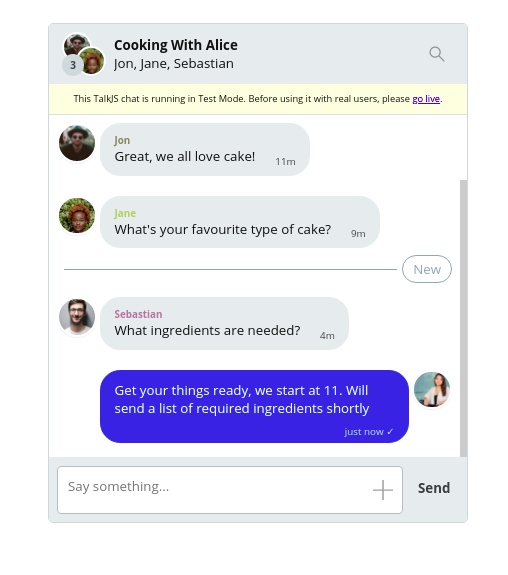
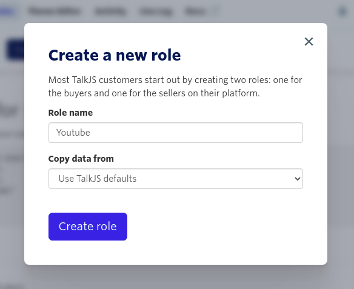
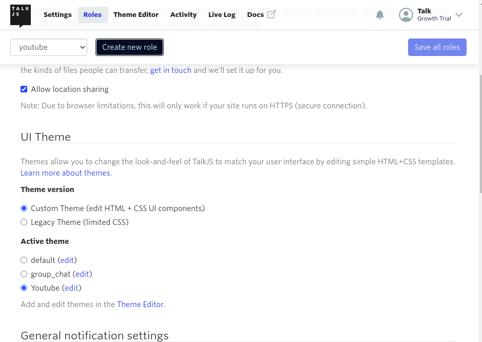
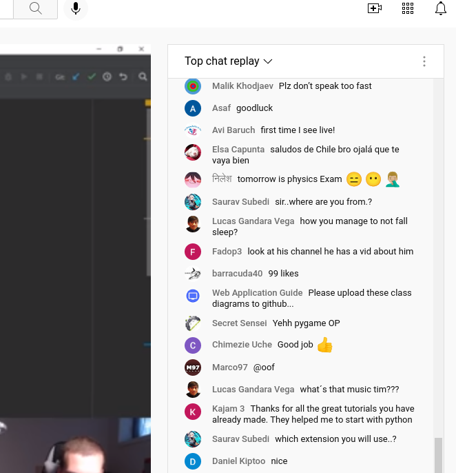
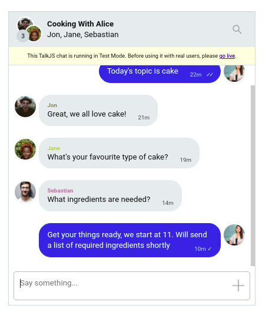
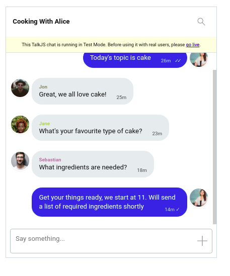
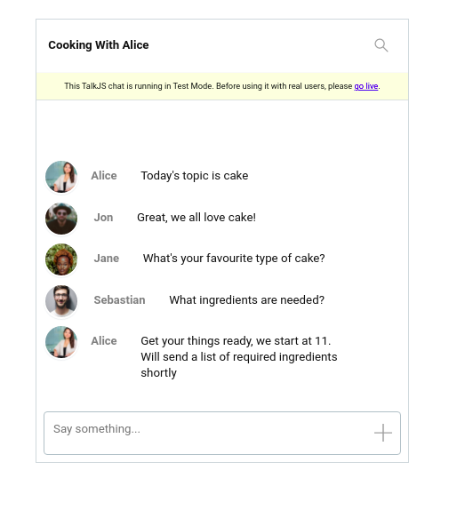
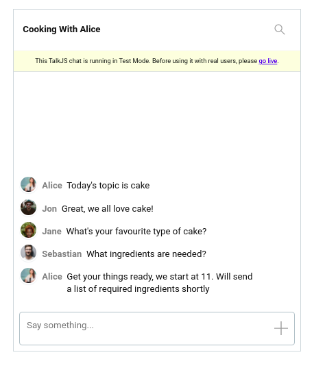

# How to build a live comments section similar to Youtube Live
Let us imagine you are running an online class on cooking, where you deliver live lessons via video, like Youtube. You might need a real time chat that allows your students to comment in real-time as they follow along. In this tutorial we'll show how to build a group chat with live comments inspired by Youtube Live using the [TalkJS API](https://talkjs.com) and The Theme Editor.

Let's get started.

## Setting Up Our Project

We need to do the following:

1. Create a group conversation.
2. Create role(s).
3. Create and customize our theme for the role(s).

## Creating a group conversation

First we'll create a group conversation with multiple users. This is covered in the [Group Chats docs](https://talkjs.com/docs/Features/Group_Chats/). Remember to use your TalkJS appId, this is found in the [dashboard](https://talkjs.com/dashboard). You may want to add the `photoUrl` property to each user so they get an avatar. Free images can be found on places like [pexels](https://pexels.com), [unsplash](https://unsplash.com) etc.

We can specify a `subject` using `session.setAttributes`. We then use the chatbox UI mode to render our chat:

```javascript
Talk.ready.then(function() {
    ...
    conversation.setAttributes({
        subject: "Cooking With Alice"
    });
    var chatbox = talkSession.createChatbox(conversation);
    chatbox.mount(document.getElementById("talkjs-container"));
})
```

Our chat will look like this:




## Creating Roles

Now we need to create roles for our users in the dashboard. In the header of the dashboard, click on **Roles** and add a new role. You can name this whatever you want, for example "youtube".



We then need to add the `role` property to our users, and specify it to be our newly created role, in our case `youtube`.

```
var me = new Talk.User({
    id: "123456",
    name: "Alice",
    email: "alice@example.com",
    photoUrl: "/path_to_photo",
    role: "youtube"
});

....

var other1 = new Talk.User({
    id: "234567",
    name: "Alice",
    email: "alice@example.com",
    photoUrl: "",
    role: "youtube"
});

```

### Activating a theme

The theme that is used to display a TalkJS chat UI depends on the current user's role. If no role is set, the default theme is used.

To configure a theme for a role, go to dashboard, and click Roles, then create or select a role and scroll down to the "UI Theme" section and click on edit.




### Customizing our Theme

Now that we have our role all set up, we can customise our layout to look better using the Theme Editor. We'll draw some inspiration from Youtube Live's chat feature.



### Things To Do
- Change Font to Youtube's font
- Remove rounded corners from the chatbox
- Remove Avatar and group member names 
- Change header background color to white
- Have all messages on the left side and remove timestamp
- Remove the backgrounds on chat bubbles
- Display message text next to the username
- Reduce gap between messages

#### The `Chatbox` Layout
We start by customizing the whole chatbox to get it closer to the Youtube one. 
The first thing we'll do is change the font to Roboto. So in our **Theme Editor** we navigate to **Layouts** >> **Global** and change the font to Roboto.

In the **Panels** section of **Layouts** we can delete the  value in the `borderRadius` field or set it to zero to remove the rounded corners.

We also have to give the whole Chatbox a faint grey background, (#f9f9f9), and change the **Panel Footer** to a **backgroundColor** of white (#fff).



#### The `ChatHeader` Component

The ChatHeader component contains the UI code for the chatbox or inbox header. We can delete the following lines 38-40, to get rid of the avatar :

```
<div class="image">
    <ConversationImage conversation="{{conversation }}" />
</div>

```

To remove the user lists we need to delete line 41:

```
<div class="subtitle">{{ names }}</div>

```
We then scroll down to the `.header` class and and change the background-color to #FFF (white) from the default gray and then add a `border-bottom` of `1px solid #FAFAFA`. This gives the header a faint gray bottom border.

Our chatbox panel now looks like so:



### The `UserMessage` Component

In the Theme Editor, we navigate to the **UserMessage** component. This is where most of the code for our UI lives.

We want all our messages to be on the left side. To achieve this we find the `.message-row.by-me` class (line 90) and delete it or remove the `flex-direction` property.

We then replace lines 67 -71:

```
<div t:if="{{ sender.isMe == false and conversation.others.length > 1 }}"
    class="message-author"
    style="color: {{ sender.id | random_color }}">
    {{ sender.name }}
</div>

```
with:

```
<div t:if="{{ conversation.others.length > 0 }}" class="message-author"
    style="color: gray; font-size: 13px">
   {{ sender.name }}
</div>

```
This changes the randomly assigned username colors to a fixed gray one and sets a font size of 13px.

We then remove the timestamps and status ticks from the chats by navigating to line 73 and deleting `timestamp="{{ timestamp }}" floatTimestamp="auto" showStatus="{{ sender.isMe }}"`.
```
<MessageBody body="{{ body }}" timestamp="{{ timestamp }}" floatTimestamp="auto" showStatus="{{ sender.isMe }}" isLongEmailMessage="{{isLongEmailMessage}}" />
```

Our chat will look like this:

.

We have made some progress, but we still need to have our texts show up next to the avatar like on Youtube, and remove the chat bubble backgrounds.

To have our messages float besides the username, we go to the `.message` class and add the following:

```
display: flex;
```

We also want to remove the border properties, so we delete the associated border properties, ie `border-radius`, `border-width` and `border-style`. We also delete `background-color`. The message class should look like so:

```

.message {
    white-space: normal;
    overflow: hidden;
    word-wrap: break-word;
    position: relative;
    display: inline-block;
    max-width: calc(100% - 6rem - 0.25rem - 0.25rem);
    border-color: #E7ECEE;
    color: #111;
    display: flex;
}

```

Still in the `UserMessage` component, we find the class `.by-me.message` and delete the `border-color` and `background-color` properties. We also change the `color` property to match the default text, in this case  a shade of black (#111).

Edit the `.message-row` class to: 

```
margin-bottom: 0.5rem;
margin-top: 0.5rem;
display: flex;

````


Our Chat UI will look like this: 




## Wrapping Up

We need to do a few final tweaks to move our messages closer to the usernames. For this we navigate to the **MessageBody** subcomponent and change the `.text` class `padding` property to 

```
.text {
    padding: 0.5rem 0 0 0;
}
```

We also need to delete the `.by-other .message` class to better align the messages.

Lastly we can go to the **Avatar** top level component and change the `.avatar` width and height to 2rem to make the avatars a little smaller.

At which point our chat UI would look like this:




So there we have it, our final live comments chatroom inspired by Youtube and built using the TalkJS API. 

You can further customise it to achieve your desired look, including adding [unread message counters](https://talkjs.com/resources/how-to-add-a-real-time-unread-conversation-counter-to-a-talkjs-chat/), changing fonts and more, or even make it look like [WhatsApp](https://talkjs.com/resources/how-to-build-a-chat-app-that-looks-like-whatsapp-with-the-talkjs-chat-api/) or [Discord](https://talkjs.com/resources/how-to-create-a-chat-similar-to-discord-with-talkjs/) all while using the Theme Editor and the TalkJS API. TalkJS is extremely flexible and allows you to build many different kinds of layouts in a short time.
